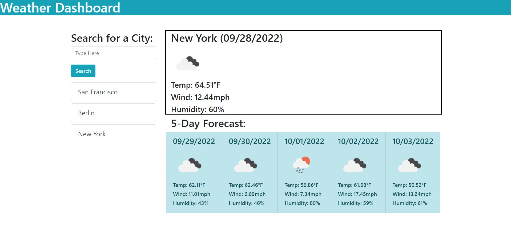

# 06_weather_dashboard

## Description

The goal of this project was to build a weather dashboard website in order to display skills learned with
Bootstrap, jQuery, and APIs.
The created site displays today's weather along with that of a five day forecast for entered locations.
This project allowed me to practice using Bootstrap to layout pages, jQuery to make modifying the DOM easier,
and to use APIs when creating websites

## Installation

N/A

## Usage

This website acts as weather dashboard. A user may enter in a city name into the search bar and then hit search
to see today's weather and a five day forecast for the entered location. Each entered location will produce a
button beneath the search bar that can be clicked to pull up the previously searched for city again. City names
may only be entered in english and weather information is displayed in imperial units where applicable. Cities
entered are not saved between page refreshes.

## Credits

N/A

## License

Please refer to the license in the repo

## Links and Images
Github pages URL: https://fortu038.github.io/06_weather_dashbaord/

